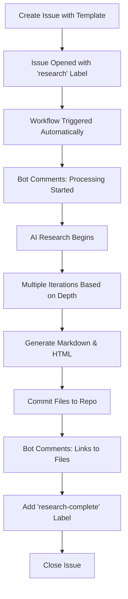

# Issue Template Examples

This document shows examples of completed issue templates and their results.

## Example 1: Standard Research on AI

### Input (via Issue Template)
```
Research Topic: "Large Language Models in Healthcare Diagnostics"

Research Depth: Standard Research

Additional Context:
- Focus on recent developments (2024-2026)
- Include accuracy comparisons with traditional methods
- Discuss privacy and ethical considerations

Specific Requirements:
- Include citations for key studies
- Provide real-world implementation examples
```

### Expected Output
- **Markdown**: `docs/research_Large_Language_Models_in_Healthcare_Diagnostics_20260214_143022.md`
- **HTML**: `html/research_Large_Language_Models_in_Healthcare_Diagnostics_20260214_143022.html`
- **Iterations**: 4 research phases + executive summary
- **Time**: ~5-7 minutes

---

## Example 2: Quick Overview

### Input
```
Research Topic: "TypeScript vs JavaScript Performance"

Research Depth: Quick Overview

Additional Context:
- Focus on runtime performance only
- Include benchmark comparisons
```

### Expected Output
- **Iterations**: 2 research phases + summary
- **Time**: ~2-3 minutes
- Quick, high-level comparison

---

## Example 3: Deep Dive

### Input
```
Research Topic: "Quantum Error Correction Techniques"

Research Depth: Deep Dive

Additional Context:
- Cover surface codes, topological codes, and concatenated codes
- Include mathematical foundations
- Compare different approaches

Specific Requirements:
- Include technical diagrams descriptions
- Provide equations and formulas
- Cite academic papers
```

### Expected Output
- **Iterations**: 6 research phases + comprehensive summary
- **Time**: ~10-15 minutes
- Exhaustive technical analysis

---

## Example 4: Comparative Analysis

### Input
```
Research Topic: "Kubernetes vs Docker Swarm vs Nomad"

Research Depth: Standard Research

Additional Context:
- Compare scalability, ease of use, and ecosystem
- Include production deployment considerations
- Focus on enterprise use cases

Specific Requirements:
- Create comparison tables
- Include real-world case studies
- Provide migration guidance
```

### Expected Output
- Structured comparison across multiple dimensions
- Tables showing feature comparisons
- Practical recommendations

---

## Issue Workflow Visualization



## Tips for Best Results

### Topic Formulation
✅ **Good Topics:**
- "Impact of Serverless Architecture on Development Workflow"
- "Rust Memory Safety Mechanisms Explained"
- "Renewable Energy Storage Solutions in 2025"

❌ **Avoid:**
- "Technology" (too broad)
- "Tell me about computers" (unclear)
- "What is everything?" (not specific)

### Context Provides Value
Adding context helps the AI focus on what matters to you:

**Without Context:**
> Topic: "Machine Learning"
> (Results may be generic)

**With Context:**
> Topic: "Machine Learning"
> Context: 
> - Focus on reinforcement learning
> - Applications in robotics
> - Recent breakthroughs in 2025
> (Results will be targeted and relevant)

### Choosing Depth

| Choose This | When You Need |
|-------------|---------------|
| **Quick Overview** | Fast summary, deciding if topic is worth deeper research, initial exploration |
| **Standard Research** | Balanced coverage, learning a new topic, getting comprehensive overview |
| **Deep Dive** | Exhaustive analysis, technical deep-dive, academic-level research |

## Common Use Cases

1. **Learning New Technologies**
   - Depth: Standard Research
   - Context: Include tutorials, best practices, common pitfalls

2. **Technical Decision Making**
   - Depth: Standard Research or Deep Dive
   - Context: Comparison criteria, specific requirements, constraints

3. **Academic Research**
   - Depth: Deep Dive
   - Context: Specific papers to reference, theoretical focus, mathematical rigor

4. **Quick Fact-Checking**
   - Depth: Quick Overview
   - Context: Specific claims to verify, date ranges

5. **Market/Technology Trends**
   - Depth: Standard Research
   - Context: Time period, geographic focus, industry specifics

